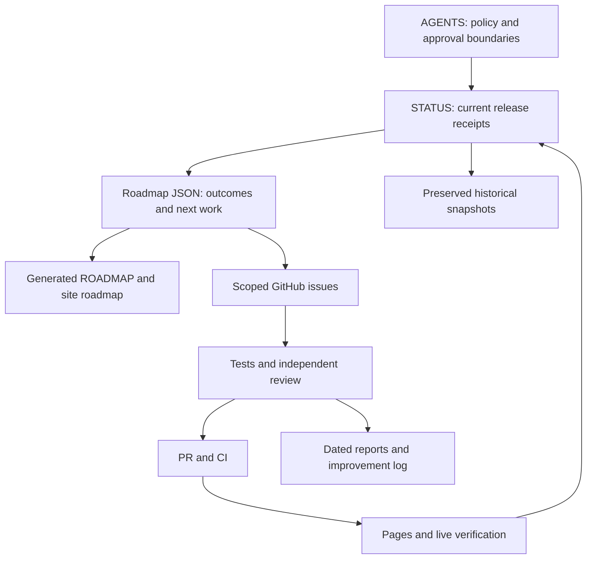

# Project Alignment Review - October 8, 2026

## Scope And Decision

Repository-wide governance and documentation inventory, not an exhaustive
source-code, security, dependency, database or mechanics recertification.
Reviewed root instructions, current status, roadmap source/output, dated release
evidence, root artifact inventory, open GitHub issue titles, workflow inventory
and the latest run per workflow found in the most recent 100 runs.
Independent read-only review challenged stale guidance and preservation risks.

Preserve the free doubles simulator/evidence priority. No new product direction,
paid service, scheduler, source approval or database change is introduced.

## One Authority Per Purpose

## Drift Corrected

- STATUS mixed 198-era candidates with 142-era deployment claims and a stale
  security-first task list. Replaced with one v198 receipt, scope and ordered queue.
- Archived the full previous STATUS; no failed/pending historical observation lost.
- Root and app MASTER_PROMPT and DEVELOPMENT_RUNBOOK are now historical entry points.
  Their complete previous content remains archived; old copy-as-instructions,
  direct-to-main and single-file recipes are not current instructions.
- README no longer calls the preview a stable/certified build, claims a best
  mobile experience, promises zero dependencies, or publishes stale test/team
  counts. Local serving, current tests and coaching limits are explicit.
- Roadmap milestone now agrees with next_action: 262 review-only M-C identities.
  Historical still-M-B reference observation is explicitly dated and superseded.
- AGENTS requires concise status and post-deployment receipt reconciliation.

## Priority And Ownership

All issue numbers here refer to TheYfactora12/Pokemon-Champions-Sim-Planner.
These are responsibility roles, not claims of GitHub assignees.

| Area | Owner role | Current decision |
| --- | --- | --- |
| Mega identity/lifecycle #241 | Mechanics engineer + independent reviewer | First implementation priority |
| Items #235, moves #245 | Mechanics engineer + source reviewer | Repair actual effective behavior; mirror differences alone are not bugs |
| Official M-C #232 | Evidence reviewer + human approver | 262 identities are candidates, not package approval |
| Team viability #228 | Product/QA | Retain as umbrella, link scoped children |
| Results/replays #242/#238/#240 | UI/evidence engineer | Must explain the actual battle, not unsupported coaching |
| Coaching/mobile #209/#211/#213/#221 | QA/UI reviewer | Preserve open acceptance gaps |
| DB/security #102/#103 | Security reviewer + human operator | No fresh live database verification in this cleanup |
| LLM, premium, analytics expansion | Product owner | Deferred, not closed as completed |

No issue was closed solely on title similarity. Source-watch issues with
different fingerprints are not proven duplicates. Historical cross-repo issue
numbers are not interchangeable. Review acceptance evidence before closure.

## Remote And Workflow Readback

Baseline primary main: 8191d27326d7a1b1cf328317f9e4921ba10bde93 (v198).
Alfredo main: 15f0f98194e9e766f660ec40945b6e070c0343ca. No overwrite or backup
sync performed; different revisions do not establish file-tree or failover parity.

Recent successful runs observed: CI 37855405962, Pages 37855405638,
News Feed Sync 37784386482, Showdown Sync 37831257288, Daily Sim Heartbeat
37830055899, M-C Reference Drafts 37854847659. Success is run status, not a
claim that every source was available or every mechanic verified.
Regulation Watch is disabled_manually; do not call monitoring active.
Other listed workflows being enabled is not proof of recent execution.
No workflow was deleted, enabled, disabled or dispatched by this cleanup.

## Preservation And Cleanup Limits

Archives originate from commit 8191d27326d7a1b1cf328317f9e4921ba10bde93.
Original root-relative links retain context in that commit; archive snapshots
are historical text, not relocated operational instructions.

Normalized-text SHA-256 (CRLF normalized and trailing newline ignored):
- STATUS: e3e0653b035c3c9d46ef0a60652a2ac69486df6a38f30a19114d96611b232a2b
- MASTER_PROMPT: 9ee734b7b0163079762fc62c52ae5b1a2afd2592f806a033453095d3e127c075
- DEVELOPMENT_RUNBOOK: e84ec460b7e9406a7c3acce7c5a1369b1e916d4de1006796ee2018de41dea3f0

Preserved root draft patches, historical specs, tar archive, migrations, pinned
reference checkout, private test artifacts and rollback files. Before removing
any, establish references/consumers, a replacement, reproducibility and retention
need. They are cleanup candidates, not proven garbage. No disk deletion performed.

## Verification

Archive content compared with original commit; all four match after stated
newline normalization. Applicable documentation links, roadmap generation,
bundle identity and hosted checks recorded in the PR. Runtime changes are
release identity and roadmap content only; no new mechanics test claim.
The earlier v197 regression and v198 release proof retain their original scope.
Follow-up after deployment: record the exact receipt in STATUS without another
runtime version bump merely for documentation. No universal alignment claim.

## Deployment Follow-Up

PR246 merged as 3c6dca619916f7aedea09de582eb6cbc1a4b005c. CI 37856610213,
bundle/cache checks and Pages 37857086095 passed. HTTP artifact and four external
asset checks passed at 2026-10-08T23:05:35.983Z; fresh browser verified v199 and
the corrected expanded regulation milestone. [Receipt](https://github.com/TheYfactora12/Pokemon-Champions-Sim-Planner/pull/246#issuecomment-6070804929).
This follow-up changes documentation only, not the tested app artifact.
GitHub-reported dependency alerts are tracked separately in #247, untriaged.
