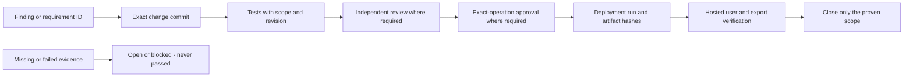

# Release Audit And Traceability

Scope: October 5 release work through v172, plus the required audit contract
for subsequent changes. This is not a claim that every historical change in the
repository has been retrospectively audited. Earlier records remain in the
[improvement log](../IMPROVEMENT_LOG.md); unmapped history stays unverified.
[STATUS.md](../../STATUS.md) owns current state and [ROADMAP.md](../../ROADMAP.md)
owns priorities. Never infer production completion from this inventory.

## Evidence Chain

## Current Change Ledger

Commit links are immutable. Test counts below summarize previously recorded
evidence, not newly rerun tests. All code changes listed remain candidate-only
at this record; production comparison last observed v142, not v172.

| Record / change | Commit | Evidence | Boundary and remaining work |
| --- | --- | --- | --- |
| IMP-0053 base/Mega ability preservation and bounded Pilot Guide | [b8f02a3](https://github.com/TheYfactora12/Pokemon-Champions-Sim-Planner/commit/b8f02a3) | Improvement log: 10 ability cases, 32 analytics checks, independent mechanics review | Imported/end-to-end and hosted proof are separate |
| IMP-0054 converted move type before immunity | [f525e7d](https://github.com/TheYfactora12/Pokemon-Champions-Sim-Planner/commit/f525e7d) | ability_type_execution_tests.mjs; independent pinned-reference review; [findings](REPLAY_EXECUTION_FINDINGS_2026-10-05.md) | Scoped mechanics boundary, not universal accuracy |
| IMP-0054 replay download and audit provenance | [f525e7d](https://github.com/TheYfactora12/Pokemon-Champions-Sim-Planner/commit/f525e7d) | replay_download_lifecycle_tests.mjs; download_qa_audit_tests.mjs; actual v169 downloaded evidence | Final-candidate download/visible pairing still open |
| IMP-0055 true starting state | [5b05de2](https://github.com/TheYfactora12/Pokemon-Champions-Sim-Planner/commit/5b05de2) | 38 turn-log checks; 15 comparator checks; independent 136 paired games and 3,200 snapshot checks | Additive snapshot evidence; prior action timing preserved |
| Preserve main news during reconciliation | [2f34e15](https://github.com/TheYfactora12/Pokemon-Champions-Sim-Planner/commit/2f34e15) | Main 45c9e28 feed retained; generated bundle rebuilt; hosted CI passed | Does not imply deployment or news-content approval beyond existing process |
| IMP-0056 mobile results overflow | [b998541](https://github.com/TheYfactora12/Pokemon-Champions-Sim-Planner/commit/b998541) | Five layout assertions; 190 fast and 12 offline DB files; bounded viewport measurements; independent release review | Full player journey pending; four manual/helper files skipped |
| IMP-0057 live security readback | [332c9ea](https://github.com/TheYfactora12/Pokemon-Champions-Sim-Planner/commit/332c9ea) | Authorized metadata only; 60 denied writes in isolated PostgreSQL fixtures | Live containment gate unmet; no production mutation or real-user isolation proof |
| Dependency inventory | [1fb4467](https://github.com/TheYfactora12/Pokemon-Champions-Sim-Planner/commit/1fb4467) | Production npm scope zero advisories; full tree 15 | Point-in-time inventory; development/CI exposure review open |
| IMP-0058 production artifact checkpoint | [b09dd4a](https://github.com/TheYfactora12/Pokemon-Champions-Sim-Planner/commit/b09dd4a) | production_alignment_tests.js: six fixtures; live HTTP mismatch report | v142 versus v172 and four absent assets; not browser behavior proof |
| Approved staging attempt and Docker repair | [5941ee3](https://github.com/TheYfactora12/Pokemon-Champions-Sim-Planner/commit/5941ee3), [5b85223](https://github.com/TheYfactora12/Pokemon-Champions-Sim-Planner/commit/5b85223) | Preserved socket backups; Docker engine 29.6.2 responds; Desktop running | Host repair only; no local Supabase security test or production change |
| Architecture and release diagrams | [a66bf48](https://github.com/TheYfactora12/Pokemon-Champions-Sim-Planner/commit/a66bf48) | [Release review](V172_RELEASE_GATE_REVIEW_2026-10-05.md); diff check | Documentation is not runtime verification |

Test filenames refer to [poke-sim/tests](../../poke-sim/tests). Detailed test
scope, exclusions and recovery paths live in the linked reports. Hosted CI
must be retrieved for the final SHA: success on an ancestor is not automatically
success on a later commit. [PR 195](https://github.com/TheYfactora12/Pokemon-Champions-Sim-Planner/pull/195)
is the review thread, not proof of approval or deployment.

## Required Record For Every Change

Use an existing IMP or issue ID rather than creating duplicate findings. Record:

| Field | Required evidence |
| --- | --- |
| Why | Finding/requirement, observed behavior, source and expected behavior |
| What | Exact commit, affected files, change class and excluded scope |
| Who | Implementer and actual reviewer; never attribute approval to an absent person |
| Test | Command, environment, tested SHA/build, time, result, skips and evidence location |
| Battle | Engine/ruleset/regulation, stable team/member IDs, seed, run policy and paired logs |
| Database | Environment, migration fingerprint, readback and ownership tests; no credentials |
| Approval | Exact operation/artifact, human approval reference when required; pending if absent |
| Release | Merge SHA, workflow/run URL, deployed URL, bundle/asset hashes and observed build |
| Recovery | Revert or disable procedure, preserved data, rollback verification status |
| Closure | Local, reviewed, deployed and verified states separately; named remaining gaps |

For retained evidence files, record schema, byte size and SHA-256. Keep raw
private teams, authentication material and sensitive findings outside the public
repository; public records use sanitized IDs and scope. A local log that was not
retained/uploaded must not be described as an available GitHub artifact.

## Open Evidence Inventory

- Final-candidate actual download versus every relevant visible replay event.
- Complete desktop/mobile choose, validate, simulate, inspect and edit journey.
- Local Supabase setup, real Auth two-user tests and approved production hardening.
- Live post-change readback, private-save scope and schema disposition.
- Development dependency exposure/remediation and final exact-SHA release review.
- Production deployment/run URL, matching artifact checkpoint and browser checks.
- Alfredo synchronization after production verification.
- Historical changes not mapped here require their own evidence; no bulk closure.

Current approval to prepare staging is not approval of an unspecified migration.
No verified 99% accuracy, competitive regulation certification, or production
readiness claim follows from the number of passing tests or diagrams.
