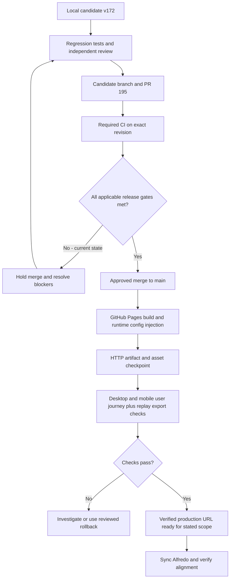
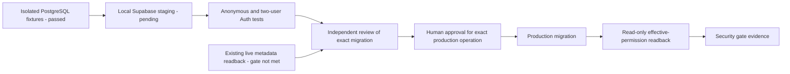
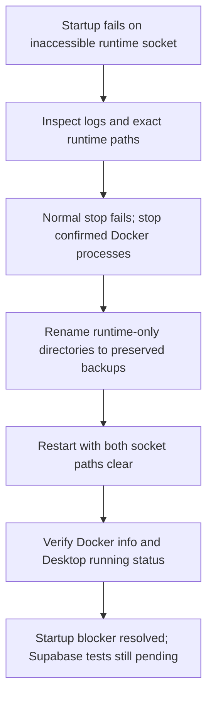

# v172 Release Gate Review

Date: October 5, 2026. Candidate: b9985416ce66a31133c809693e1f26b2e45eab78.
Build: v2.2.172-mobile-results. Engine: 1.1.14.

## At A Glance

This is a dated evidence record, not a replacement roadmap. [STATUS.md](../../STATUS.md)
owns current proof state; [ROADMAP.md](../../ROADMAP.md) owns milestone direction.
Changes are recorded in [IMPROVEMENT_LOG.md](../IMPROVEMENT_LOG.md), IMP-0056
through IMP-0058. Work ships through [PR 195](https://github.com/TheYfactora12/Pokemon-Champions-Sim-Planner/pull/195).

| Checkpoint | October 5 evidence | Still needed |
| --- | --- | --- |
| Local v172 mobile fix | Five focused assertions; full local gate passed | Full final-candidate player journey |
| Independent review | CSS/version delta, bundle reproduction and asset checks | Final exact-revision release disposition |
| GitHub candidate | Code b998541; later checkpoint and documentation commits | Required checks on final merge revision |
| Production comparison | HTTP check: live/main v142, local v172; four newer assets absent | Approved deploy, artifact comparison and browser checks |
| Docker repair | Engine 29.6.2 responding; Desktop running; backups preserved | Local Supabase stack and security tests |
| Shared-write containment | 60 isolated fixture writes denied; live gate not met | Staging validation, exact production approval and readback |
| Private saves | Required live schema absent | Scope/schema review and two-user Auth isolation proof |
| Dependencies | Production npm set: zero advisories; full tree: 15 | Review development/CI exposure and tested remediation |

## Release Flow

Production target: [TheYfactora12 public simulator](https://theyfactora12.github.io/Pokemon-Champions-Sim-Planner/poke-sim/pokemon-champion-2026.html).
Run `node poke-sim/tools/check-production-alignment.cjs` from the tested checkout.
The JSON result checks build identity, repository provenance, deployed HTML and
declared asset hashes/sizes. It accounts for Pages configuration injection.
It does not certify database security, service-worker cache behavior or game
accuracy. Retain the result with the reviewed SHA and Pages run URL. See the
[release checklist](PUBLIC_PRACTICE_RELEASE_CHECKLIST_2026-10-05.md).

## Security Boundaries

No arrow represents a completed production operation. Local tests must never
target the main database. No paid cloud resources were created. Synthetic
role fixtures are not two real Auth sessions. Sensitive policy details and
secrets do not belong in this public document.

## Docker Recovery

This is a record of the observed repair, not a general instruction to rename
arbitrary Docker folders. Inspect exact paths and contents, stop Docker first,
and preserve backups. Do not factory-reset, delete volumes or unregister WSL.
Backup names and the verification evidence are recorded below.

## Verified Candidate Scope

- Mobile chart and audit grid intrinsic-width fix: five focused assertions pass.
- Full local gate: 190 fast files and 12 offline DB files pass; four manual/helper
  files skipped. This is not a live security or universal mechanics verdict.
- Independent release reviewer reproduced bundle generation byte-for-byte and
  checked external-asset hashes, artifact size/hash, layout assertions and diff
  whitespace. No additional defect found in this CSS/version delta.
- Candidate pushed to existing PR 195. No production merge or deployment.

## Live Administrative Readback

Authorized metadata-only queries ran in read-only transactions. No user rows,
credentials or routine bodies were retrieved. No database changes were made.

- Connected account exposes one healthy project and only its default branch.
  No isolated cloud staging environment was established.
- Effective grants and policies do not yet satisfy the shared-evidence
  containment contract. Keep sensitive detailed findings out of public records.
- Private-save schema prerequisites are absent in this project. Two-user
  ownership cannot be reported as verified.
- Migration ledger returns four legacy entries. Other schema objects exist,
  so ledger absence alone is not proof that all later SQL never ran. Actual
  permissions and schema readback, not migration filenames, determine status.
- Security advisor output does not replace application-specific policy review.
  An enabled-RLS/no-policy informational notice is not permission to add access.

## Free Isolated Validation

Reused repository test-shared-write-containment.mjs with validation-only PGlite
0.5.8 installed outside the repository. No production package change or paid
service was introduced. The existing migration applies twice, denies 60 browser
write attempts, preserves public reads and permits six trusted writes.
Re-granted DML remains blocked by restrictive RLS; missing-table and inherited
grant failures abort with rollback. Synthetic fixtures do not substitute for
the actual Supabase schema, Auth sessions or two-user isolation tests.

Docker CLI exists but its daemon was not running. Local Supabase staging setup
was proposed to the owner; no daemon, cloud project or billable branch started.

October 5 follow-up after owner approval: attempted Docker Desktop startup and
verified Supabase CLI 2.119.0 command help. Docker's backend failed while
initializing its dockerInference runtime socket (Windows inaccessible-file /
invalid-name errors). The waiting docker info command was cancelled. No local
Supabase stack, cloud resource or production mutation was created. No factory
reset, socket deletion, Docker settings change or machine reboot performed.
Preserve existing Docker data; repair startup before claiming Auth/two-user
staging proof. The earlier no-start note records the pre-approval state.

October 5 repair follow-up: normal Docker stop timed out. Stopped only confirmed
Docker Desktop/backend processes and quarantined temporary socket directories
by renaming them, with no deletion. Both the inference and secrets-engine
socket paths had to be cleared together; sequential retry recreated a stale
inference socket. The secrets-engine directory was checked to contain only
its zero-byte engine.sock before quarantine. No credentials were read.
Backups under LOCALAPPDATA are Docker/run.codex-backup-20261005-115325,
Docker/run.codex-backup-20261005-second, and
docker-secrets-engine.codex-backup-20261005. Preserve them for recovery; only
restore while Docker is stopped, preserving newly created runtime paths first.
Docker info now reports server 29.6.2 and WSL reports docker-desktop running.
No factory reset, container/volume deletion, settings edits or reboot performed.
This closes the observed startup blocker, not the Supabase security gate.

## Release Decision

Dependency audit follow-up: npm audit --omit=dev for poke-sim returned zero
advisories. The complete tree returned 15 (one critical, nine high, three
moderate, two low), including the pinned Showdown development dependency chain.
This is a dependency inventory, not proof of runtime exploitability or a clean
CI supply chain. Do not run a forced audit fix that silently changes the oracle;
review the affected tools and validate any lockfile/reference update separately.
The default-branch GitHub warning reports a different scope (27 alerts).

Hold production merge. An experimental label or hidden cloud-save controls do
not isolate the existing database or waive the roadmap's security gates.
Pages currently includes live database configuration and merges trigger deploy.

Next steps, in order:

1. Establish approved isolated staging without paid services; validate existing
   containment against that schema and capture owner-isolation evidence where
   private saves are in scope.
2. Obtain exact-operation approval before any production migration; apply only
   the reviewed immutable change and perform permission readback afterward.
3. Complete final downloaded replay/visible pairing and desktop/mobile edit
   journey for the candidate. Current missing downloads remain unverified.
4. Finish dependency review, exact-SHA hosted checks and independent release
   disposition; preserve rollback and regulation uncertainty.
5. Merge/deploy only after applicable gates, then verify production artifact,
   assets and user journey. Sync Alfredo after production proof, not before.

M-C source approval remains separate. Nothing here establishes 99% accuracy.
